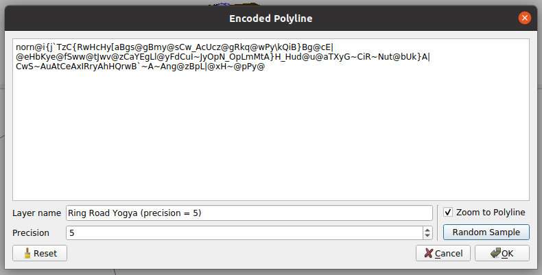

# Encoded Polygon QGIS Plugin

The plugin helps you to decode and visualize an encoded polyline and load it on QGIS as a memory layer.

## Why?

It helps to decode or visualize an encoded polyline easier. Especially with a long polyline.

## Features
- Custom layer name
- Custom precision (Google uses 5, OpenStreetMap uses 6)
- Some samples included

## About Encoded Polyline

Polyline encoding is a lossy compression algorithm that allows you to store a series of coordinates as a single string. See more explanation by Google Maps [here](https://developers.google.com/maps/documentation/utilities/polylinealgorithm).

## Alternatives
- [Interactive Polyline Encoder Utility](https://developers.google.com/maps/documentation/utilities/polylineutility). It only supports 5 digits precision
- [Valhalla Demo Tool](https://valhalla.github.io/demos/polyline/)

## Acknowledgments
- Python code for decoding encoded polyline: https://github.com/frederickjansen/polyline
- Icon is a modification from QGIS's icon: https://github.com/qgis/QGIS/blob/master/images/themes/default/mActionAddPolyline.svg
